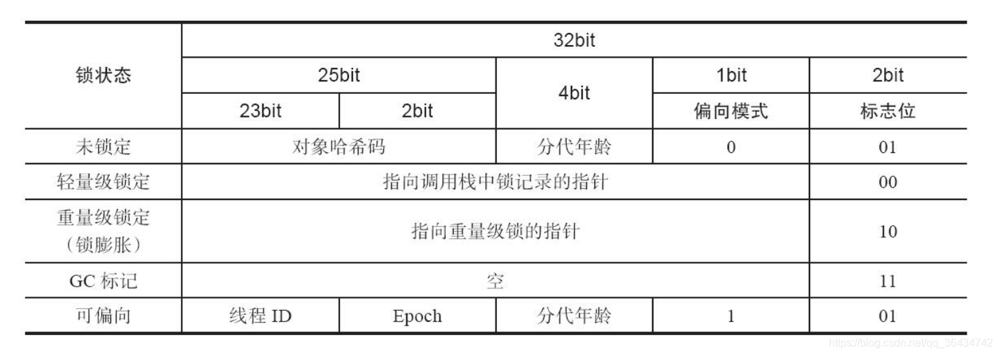
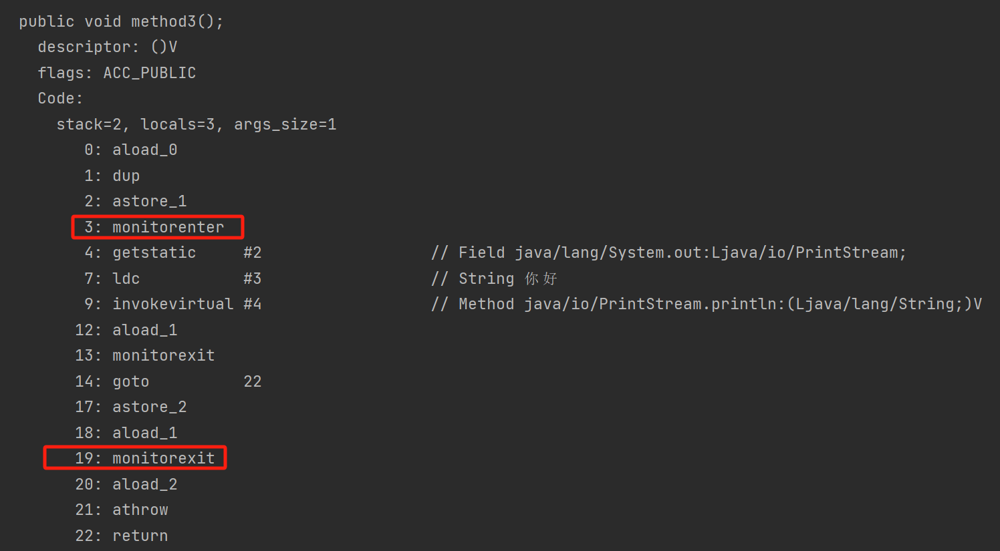
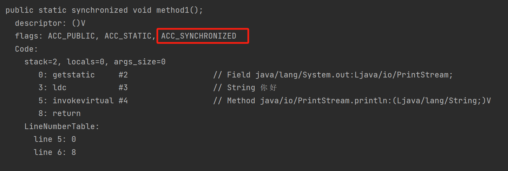

# synchronized

## 使用方式

1. 作用于静态方法

```java
public static synchronized void method1() {
    System.out.println("你好");
}
```

2. 作用于普通方法

```java
public  synchronized void method2(){

}
```

3. 代码块-作用于实例对象

```java
public void method3() {
    synchronized (this){
        System.out.println("你好");
    }
}
```

4. 代码块-作用对类对象

```java
public void method4() {
    synchronized (Demo1.class){
        System.out.println("你好");
    }
}
```

## Mark Word

JVM中，对象组成分为3个区域：

+ 对象头
+ 实例数据
+ 对齐填充

对象头由Mark Word和类型指针(Kclass pointer)组成。有关synchronized相关联的就是对象头里的Mark Word

32位JVM的对象Mark Word图如下：



可以看到Mark Word中其中1bit表示偏向模式，2bit表示锁状态。

+ 最后3bit是001，表示无锁
+ 最后3bit是101，表示偏向锁
+ 最后2bit是00，表示轻量锁
+ 最后2bit是10，表示重量锁

这里就说明了synchronized是会进行锁升级的，根据Mark Word中存储的锁信息不同，代表了不同的锁重量。

synchronized锁升级的顺序是：无锁->偏向锁->轻量级锁->重量级锁。

## 锁升级

在JDK1.6，synchronized引入锁升级之前，ReentrantLock的性能比synchronized要好很多，为此synchronized引入了锁升级去优化性能，两者的性能差别并不大，相对的synchronized使用起来反而更简单。

synchronized锁升级的顺序是：无锁->偏向锁->轻量级锁->重量级锁。

### 偏向锁


在加锁时，如果不存在多线程竞争的情况。

当一个线程执行同步代码块获取锁时，会用CAS在对象头中存储自己的线程id，以后该线程在进入同步代码块时，只需要判断Mark Word中的线程ID是否是当前线程就行了。

+ 偏向锁适合不存在多线程竞争关系的情况
+ 不需要自旋获取锁，性能好

#### 对象Hash

偏向锁的对象hash变成了线程id，用来表示持有的线程。那对象的hash去哪取呢？

当一个对象计算过hash值后，它就再也不能升级成偏向锁。当一个对象正处于偏向锁状态时，如果收到了hash值计算的请求(Object.hashCode()或System.identityHashCode(Object))，那么偏向锁会立即生成为重量级锁，将Mark Word存储在重量级锁内。

### 轻量级锁


如果出现多线程竞争，另一线程获取锁发现偏向锁的线程ID不是自己，会把锁状态设置为00，升级成轻量级锁，然后自旋继续获取锁对象。

轻量级锁状态下，对象Mark Word会指向线程栈帧中的Lock Record。如果对象Mark Word中指向当前线程的Lock Record，那么表示当前线程获取到了锁。其他线程需要自旋CAS获取锁。

为了防止没获取到锁的线程一直自旋下去，白白空转，CAS达到一定次数后就会升级成重量级锁（自旋锁默认的次数为 10 次可以通过 -XX:PreBlockSpin 来更改）。

### 重量级锁

重量级锁就是普通的悲观锁，没有获取到锁的线程需要被挂起，**进程需要从用户态转为内核态将线程挂起，然后从内核态转为用户态，当解锁的时候又需要从用户态转为内核态将线程唤醒。**

## monitorenter、monitorexit

对作代码块的synchronized进行javap -v查看字节码指令

```java
public void method3() {
    synchronized (this){
        System.out.println("你好");
    }
}
```



可以看到在方法的逻辑前后分别加上了monitorenter和monitorexit指令。

### monitorenter

在执行synchronized代码块之前，需要先执行monitorenter来获取对象的monitor。获取到monitor锁才能执行同步代码。执行完毕或遇到异常会执行Monitorexit才释放monitor锁。

## ACC_SYNCHRONIZED

对作用于方法的synchronized进行javap -v查看字节码指令

```java
public static synchronized void method1() {
    System.out.println("你好");
}
```



可以看到Code中的代码时正常的代码，没有synchronized带来的特殊处理，flags中有一个ACC_SYNCHRONIZED。

当调用一个设置了ACC_SYNCHRONIZED标志的方法，执行线程需要先获得monitor锁，然后开始执行方法，方法执行之后再释放monitor锁，当方法不管是正常return还是抛出异常都会释放对应的monitor锁。
