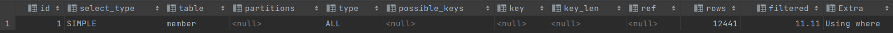

### 表结构：

本文用到的表结构

```sql
create table member
(
    member_id        bigint unsigned              not null comment '用户ID'
        primary key,
    username         varchar(32)                  not null comment '账号',
    age              int unsigned     default  0  not null comment '年龄',
    address_id       bigint unsigned              null comment '地址id',
    building_id      bigint unsigned              null comment '楼栋id',
    room_id          bigint unsigned              null comment '房间id',
    constraint idx_username
        unique (username)
)
    comment '会员';

create index idx_age
    on member (age);
    
create index idx_address_building_room
    on member (address_id, building_id, room_id);
```


### 1.数据类型不匹配

先来看几个sql

```sql
select '1a' = 1;
答案：1
select '001' = 1;
答案：1
select 'a1' = 1;
答案：0
select '1' = 1;
答案：1
```

因为mysql中字符串的特殊性，在等式两边类型不匹配时。例如如果表结构中是字符串，查询条件是int，那么不会走索引，因为有很多不同的字符串能够转换成目标数值。

#### 示例：

##### 语句

```sql
explain select * from member where username = 77620090;
```


```sql
explain select * from member where username = '77620090';
```


同样的大数的转换也会有问题

```sql
SELECT '9223372036854775807' = 9223372036854775807;
答案：1
SELECT '9223372036854775807' = 9223372036854775806;
答案：1
```


但如果表结构是int，查询调教是varchar，那么会走索引，但也会看起来怪怪的。

##### 语句

```sql
explain select * from member where age = 1;
```


```sql
explain select * from member where age = '1';
```


```sql
explain select * from member where age = '1a';
```


'1'和'1a'转换成数值的结果都是1，不会带来歧义，所以可以走索引。


### 2.模糊查询，%在最左边

```sql
explain select * from member where username like '77620090';
```


```sql
explain select * from member where username like '%77620090';
```


```sql
explain select * from member where username like '%77620090%';
```




```sql
explain select * from member where username like '77620090%';
```


如果like以%开头，会导致索引失效


### 3.索引字段存在运算

```sql
explain select * from member where age = 10;
```


```sql
explain select * from member where 2 * age = 20;
```


```sql
explain select * from member where username = 'LIBAI';
```


```sql
explain select * from member where upper(username) = 'LIBAI';
```


### 4.不符合最左前缀匹配

现有索引如下：

```sql
create index idx_address_building_room
    on member (address_id, building_id, room_id);
```

以此是地址id、楼栋id，房间id


```sql
explain select * from member where address_id = 1071102414523727872 and building_id = 1071103734446030848 and room_id = 1071103970635677696;
```


```sql
explain select * from member where address_id = 1071102414523727872 and building_id = 1071103734446030848 ;
```


```sql
explain select * from member where address_id = 1071102414523727872  and room_id = 1071103970635677696;
```


```sql
explain select * from member where building_id = 1071103734446030848 and room_id = 1071103970635677696;
```


### 5.or左右两边不都走索引

使用or时，需要前后都走索引。

```sql
explain select * from member where username = '77620090' and age = 10;
```


```sql
explain select * from member where username = '77620090' and room_id = 1071103970635677696;
```


### 6.走索引的消耗更大

当mysql的索引并不能包含查询语句所需要的所有字段时，就需要拿到二级索引查找出的id去到聚簇索引树上拿到需要的字段。这个操作也就是回表。

也就是说回表操作时：mysql会采用访问二级索引+聚簇索引的方式去完成这条查询。

但有些时候回表操作会比全表扫描的消耗更大。

#### is not null

看网上有些文章有说is not null会导致索引失效，这好像不太对。这其实也是mysql认为走索引的消耗会比全表扫描的消耗更大导致的。


```sql
explain select * from device where device_no is not null;

explain select * from device where mac is not null;
```

上面两个sql第一个不会走索引，第二个会走索引


这个device大约有38万的数据，而device_no为null的只有约5000条。走索引只排除了5000条记录，剩下的37万5000条还要回表，还不如直接走全表扫描来的快。

| id   | select_type | table  | partitions | type | possible_keys | key  | key_len | ref  | rows   | filtered | Extra       |
| :--- | :---------- | :----- | :--------- | :--- | :------------ | :--- | :------ | :--- | :----- | :------- | :---------- |
| 1    | SIMPLE      | device |            | ALL  | device_no     |      |         |      | 378696 | 50.00    | Using where |

但要是只查询device_no，不需要回表，那么就一定会走索引了

```sql
explain select device_no from device where device_no is not null;
```

| id   | select_type | table  | partitions | type  | possible_keys | key       | key_len | ref  | rows   | filtered | Extra                    |
| :--- | :---------- | :----- | :--------- | :---- | :------------ | :-------- | :------ | :--- | :----- | :------- | :----------------------- |
| 1    | SIMPLE      | device |            | range | device_no     | device_no | 259     |      | 189355 | 100.00   | Using where; Using index |


而mac为null的有约35万条，走索引就可以筛掉35万条，带来的提升很大，那么就会选择走索引了。	

| id   | select_type | table  | partitions | type  | possible_keys | key  | key_len | ref  | rows  | filtered | Extra                 |
| :--- | :---------- | :----- | :--------- | :---- | :------------ | :--- | :------ | :--- | :---- | :------- | :-------------------- |
| 1    | SIMPLE      | device |            | range | mac           | mac  | 131     |      | 43010 | 100.00   | Using index condition |

#### != 

同样的还看到过说!=不走索引的，也是因为走索引的消耗比走全表扫描的消耗更大。

#### 索引字段重复值高

例如表中有性别字段，取值不过两三项，给他创建索引，走索引筛选出来要回表的字段大概率很多，可能就不如全表扫描了。