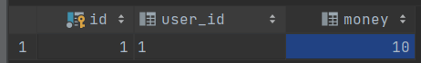
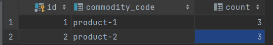
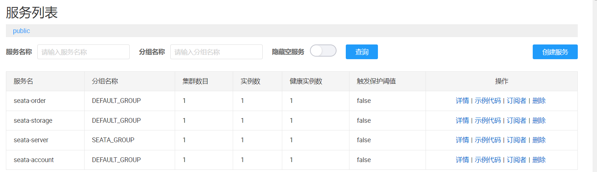

AT事务是seata的一种事务模式。AT模式也采用2PC来实现。

看一下Seata官方的描述

## 整体机制

两阶段提交协议的演变：

- 一阶段：业务数据和回滚日志记录在同一个本地事务中提交，释放本地锁和连接资源。
- 二阶段：
  - 提交异步化，非常快速地完成。
  - 回滚通过一阶段的回滚日志进行反向补偿。

可以看到AT模式相对于XA模式，AT模式在第一阶段便会提交事务(XA模式第一阶段不会提交事务，而是锁定数据)，也就意味着AT模式并不是强一致性的事务模式，而是靠反向补偿来实现最终一致性。

先来用Seata的AT模式实现一个用户下单扣减库存，创建订单，扣减余额的小demo。

## 示例

### 1.配置项目配置

使用`nacos`作为配置中心和注册中心，引入`nacos`并配置

```xml
<dependency>
     <groupId>com.alibaba.cloud</groupId>
     <artifactId>spring-cloud-starter-alibaba-nacos-discovery</artifactId>
</dependency>

<dependency>
    <groupId>com.alibaba.cloud</groupId>
    <artifactId>spring-cloud-starter-alibaba-nacos-config</artifactId>
</dependency>
```

修改`seata`的配置文件，`/conf/application.yml`，让`seata`使用`naocs`做配置中心和注册中心

```yaml
server:
  port: 7091

spring:
  application:
    name: seata-server

logging:
  config: classpath:logback-spring.xml
  file:
    path: ${user.home}/logs/seata

console:
  user:
    username: seata
    password: seata

seata:
  config:
    type: nacos
    nacos:
      server-addr: 127.0.0.1:8848
      namespace:
      group: SEATA_GROUP
      username: nacos
      password: nacos
      context-path:
      ##if use MSE Nacos with auth, mutex with username/password attribute
      #access-key: ""
      #secret-key: ""
      data-id: seataServer.properties
  registry:
    # support: nacos, eureka, redis, zk, consul, etcd3, sofa
    type: nacos
    nacos:
      application: seata-server
      server-addr: 127.0.0.1:8848
      group: SEATA_GROUP
      namespace:
      cluster: default
      username: nacos
      password: nacos
      context-path:
      ##if use MSE Nacos with auth, mutex with username/password attribute
      #access-key: ""
      #secret-key: ""

#    service-port: 8091 #If not configured, the default is '${server.port} + 1000'
  security:
    secretKey: SeataSecretKey0c382ef121d778043159209298fd40bf3850a017
    tokenValidityInMilliseconds: 1800000
    ignore:
      urls: /,/**/*.css,/**/*.js,/**/*.html,/**/*.map,/**/*.svg,/**/*.png,/**/*.ico,/console-fe/public/**,/api/v1/auth/login
```

可以通过`data-id: seataServer.properties`看到上面`seata`的配置中使用到了`nacos`配置中心的`seataServer.properties`，在`nacos`中配置一下，使`seata`使用`mysql`做事务存储

```properties
#Transaction routing rules configuration, only for the client
service.vgroupMapping.default_tx_group=default

#Transaction storage configuration, only for the server. The file, db, and redis configuration values are optional.
store.mode=db
store.lock.mode=db
store.session.mode=db
#Used for password encryption
store.publicKey=

#These configurations are required if the `store mode` is `db`. If `store.mode,store.lock.mode,store.session.mode` are not equal to `db`, you can remove the configuration block.
store.db.datasource=druid
store.db.dbType=mysql
store.db.driverClassName=com.mysql.cj.jdbc.Driver
store.db.url=jdbc:mysql://127.0.0.1:3306/seata?useUnicode=true&rewriteBatchedStatements=true
store.db.user=root
store.db.password=123456
```

创建`seata`库，并执行下面建表语句

```sql
create table branch_table
(
    branch_id         bigint        not null
        primary key,
    xid               varchar(128)  not null,
    transaction_id    bigint        null,
    resource_group_id varchar(32)   null,
    resource_id       varchar(256)  null,
    branch_type       varchar(8)    null,
    status            tinyint       null,
    client_id         varchar(64)   null,
    application_data  varchar(2000) null,
    gmt_create        datetime(6)   null,
    gmt_modified      datetime(6)   null
);

create index idx_xid
    on branch_table (xid);

create table distributed_lock
(
    lock_key   char(20)    not null
        primary key,
    lock_value varchar(20) not null,
    expire     bigint      null
);

create table global_table
(
    xid                       varchar(128)  not null
        primary key,
    transaction_id            bigint        null,
    status                    tinyint       not null,
    application_id            varchar(32)   null,
    transaction_service_group varchar(32)   null,
    transaction_name          varchar(128)  null,
    timeout                   int           null,
    begin_time                bigint        null,
    application_data          varchar(2000) null,
    gmt_create                datetime      null,
    gmt_modified              datetime      null
);

create index idx_status_gmt_modified
    on global_table (status, gmt_modified);

create index idx_transaction_id
    on global_table (transaction_id);

create table lock_table
(
    row_key        varchar(128)      not null
        primary key,
    xid            varchar(128)      null,
    transaction_id bigint            null,
    branch_id      bigint            not null,
    resource_id    varchar(256)      null,
    table_name     varchar(32)       null,
    pk             varchar(36)       null,
    status         tinyint default 0 not null comment '0:locked ,1:rollbacking',
    gmt_create     datetime          null,
    gmt_modified   datetime          null
);

create index idx_branch_id
    on lock_table (branch_id);

create index idx_status
    on lock_table (status);

create index idx_xid
    on lock_table (xid);
```

项目引入`seata`依赖

```xml
<dependency>
    <groupId>com.alibaba.cloud</groupId>
    <artifactId>spring-cloud-starter-alibaba-seata</artifactId>
</dependency>
```

修改每个项目的`application.yml`或`bootstrap.yml`配置`naocs`和`seata`

```yaml
server:
  port: 9082

spring:
  profiles:
    active: dev
  application:
    name: seata-order  #每个项目的应用名称
  cloud:
    nacos:
      discovery:
        username: nacos
        password: nacos
        server-addr: localhost:8848
      config:
        username: nacos
        password: nacos
        server-addr: localhost:8848
        file-extension: yaml

seata:
  enabled: true
  # 事务分组名
  tx-service-group: default_tx_group
  service:
    # 事务分组名和集群名映射(default_tx_group:default)，default 是上文 seata server 配置的 TC 集群名
    vgroup-mapping:
      default_tx_group: default
  # 注册中心
  registry:
    type: nacos
    nacos:
      application: seata-server
      server-addr: localhost:8848
      namespace:
      group: SEATA_GROUP
      username: nacos
      password: nacos
```

注意`service.vgroupMapping.default_tx_group`这个配置，`default_tx_group`为分组，配置项值为TC集群名，集群名我们不指定就是`default`，在项目的配置中也要对应起来。

### 2.创建表结构

准备三个库，分别对应三个服务。

+ `demo_account`库中`account`表
  
  ```sql
  create table account
  (
      id      int auto_increment
          primary key,
      user_id varchar(255)  null,
      money   int default 0 null
  );
  ```

+ `demo_order`库中`order1`表
  
  ```sql
  create table order1
  (
      id             int auto_increment
          primary key,
      user_id        varchar(255)  null,
      commodity_code varchar(255)  null,
      count          int default 0 null,
      money          int default 0 null
  );
  ```

+ `demo_storage`库中`storage`表
  
  ```sql
  create table storage
  (
      id             int auto_increment
          primary key,
      commodity_code varchar(255)  null,
      count          int default 0 null,
      constraint commodity_code
          unique (commodity_code)
  );
  ```

然后分别在三个库中创建`undo_log`表(`Seata`使用)

```sql
create table undo_log
(
    id            bigint auto_increment
        primary key,
    branch_id     bigint       not null,
    xid           varchar(100) not null,
    context       varchar(128) not null,
    rollback_info longblob     not null,
    log_status    int          not null,
    log_created   datetime     not null,
    log_modified  datetime     not null,
    constraint ux_undo_log
        unique (xid, branch_id)
);
```

### 3.项目编码

实现一个简单的下订单扣减余额和库存的功能。`order`服务为入口，创建订单，然后调用`storage`服务扣库存，调用`account`扣减用户余额。

#### `order`服务

```java
@Resource
private AccountFeignClient accountFeignClient;
@Resource
private StorageFeignClient storageFeignClient;
@Resource
private OrderMapper orderMapper;

/**
 * 下单：创建订单、减库存，涉及到三个服务
 */
@GlobalTransactional
@Override
@Transactional(rollbackFor = Exception.class)
public void placeOrder(String userId, String commodityCode, Integer count) {
    Integer orderMoney = 5 * count;
    Order order = new Order();
    order.setCommodityCode(commodityCode);
    order.setCount(count);
    order.setMoney(orderMoney);
    order.setUserId(userId);
    orderMapper.insert(order);
    storageFeignClient.deduct(commodityCode, count);
    accountFeignClient.reduce(userId, orderMoney);
}
```

使用`@GlobalTransactional`开启全局事务，否则`seata`不会接管。

方法首先往订单表插入一条数据，表示创建订单，然后调用`storage`服务和`account`服务进行扣减操作。

#### `storage`服务：

```java
/**
 * 减库存
 *
 * @param commodityCode 商品编码
 * @param count 数量
*/
@Override
@Transactional(rollbackFor = Exception.class)
public void deduct(String commodityCode, int count) {
    if (commodityCode.equals("product-2")) {
        throw new RuntimeException("异常:模拟业务异常:stock branch exception");
    }

    UpdateWrapper<Storage> updateWrapper = new UpdateWrapper<>();
    updateWrapper.eq("commodity_code", commodityCode)
        .ge("count", count)
        .setSql("count = count - " + count);
    boolean update = this.update(updateWrapper);

    if (!update) {
        throw new RuntimeException("库存不足");
    }
}
```

#### `account`服务：

```java
/**
 * 减余额
 *
 * @param userId 用户id
 * @param price  金额
*/
@Override
public void reduceBalance(String userId, Integer price) {
    UpdateWrapper<Account> updateWrapper = new UpdateWrapper<>();
    updateWrapper.eq("user_id", userId)
        .ge("money", price);
    updateWrapper.setSql("money = money - " + price);
    boolean update = this.update(updateWrapper);
    if (!update) {
        throw new RuntimeException("余额不足");
    }
}
```

### 4.初始化表数据

#### `account`表



#### `storage`表



### 4.运行测试

`nacos`中的服务列表为



调用下单接口

+ 若流程执行成功，则创建新订单，库存扣减，余额扣减
+ 若库存不足，那么会回滚订单表
+ 若余额不足，则回滚订单表和库存表

## 写隔离

以下为`Seata`官网描述：

- 一阶段本地事务提交前，需要确保先拿到 **全局锁** 。
- 拿不到 **全局锁** ，不能提交本地事务。
- 拿 **全局锁** 的尝试被限制在一定范围内，超出范围将放弃，并回滚本地事务，释放本地锁。

以一个示例来说明：

两个全局事务 tx1 和 tx2，分别对 a 表的 m 字段进行更新操作，m 的初始值 1000。

tx1 先开始，开启本地事务，拿到本地锁，更新操作 m = 1000 - 100 = 900。本地事务提交前，先拿到该记录的 **全局锁** ，本地提交释放本地锁。 tx2 后开始，开启本地事务，拿到本地锁，更新操作 m = 900 - 100 = 800。本地事务提交前，尝试拿该记录的 **全局锁** ，tx1 全局提交前，该记录的全局锁被 tx1 持有，tx2 需要重试等待 **全局锁** 。


tx1 二阶段全局提交，释放 **全局锁** 。tx2 拿到 **全局锁** 提交本地事务。


如果 tx1 的二阶段全局回滚，则 tx1 需要重新获取该数据的本地锁，进行反向补偿的更新操作，实现分支的回滚。

此时，如果 tx2 仍在等待该数据的 **全局锁**，同时持有本地锁，则 tx1 的分支回滚会失败。分支的回滚会一直重试，直到 tx2 的 **全局锁** 等锁超时，放弃 **全局锁** 并回滚本地事务释放本地锁，tx1 的分支回滚最终成功。

因为整个过程 **全局锁** 在 tx1 结束前一直是被 tx1 持有的，所以不会发生 **脏写** 的问题。

## 读隔离

以下为`Seata`官网描述：

在数据库本地事务隔离级别 **读已提交（Read Committed）** 或以上的基础上，`Seata`（`AT` 模式）的默认全局隔离级别是 **读未提交（Read Uncommitted）** 。

如果应用在特定场景下，必需要求全局的 **读已提交** ，目前 `Seata` 的方式是通过 `SELECT FOR UPDATE` 语句的代理。


`SELECT FOR UPDATE` 语句的执行会申请 **全局锁** ，如果 **全局锁** 被其他事务持有，则释放本地锁（回滚 `SELECT FOR UPDATE` 语句的本地执行）并重试。这个过程中，查询是被 `block` 住的，直到 **全局锁** 拿到，即读取的相关数据是 **已提交** 的，才返回。

出于总体性能上的考虑，`Seata` 目前的方案并没有对所有 `SELECT` 语句都进行代理，仅针对 `FOR UPDATE` 的 `SELECT` 语句。

## 工作机制

### 一阶段

1. 解析`SQL`：得到 SQL 的类型（UPDATE），表（product），条件（where name = 'TXC'）等相关的信息。
2. 查询前镜像：根据解析得到的条件信息，生成查询语句，定位数据。
3. 执行业务
4. 查询后镜像：根据前镜像的结果，通过 **主键** 定位数据。
5. 插入回滚日志：把前后镜像数据以及业务 SQL 相关的信息组成一条回滚日志记录，插入到 `UNDO_LOG` 表中。
6. 提交前，向`TC(事务协调者)`注册分支：申请业务表中的行级全局锁
7. 本地事务提交：业务数据的更新和前面步骤中生成的 UNDO LOG 一并提交。
8. 将本地事务提交结果上报给`TC(事务协调者)`

### 二阶段-回滚

1. 收到`TC(事务协调者)`的回滚请求，开启本地一个事务
2. 通过`XID`和`Branch ID`查找到相应的`UNDO LOG`记录
3. 数据校验：拿 `UNDO LOG` 中的后镜与当前数据进行比较，如果有不同，说明数据被当前全局事务之外的动作做了修改。这种情况，需要根据配置策略来做处理。
4. 根据 `UNDO LOG` 中的前镜像和业务 `SQL` 的相关信息生成并执行回滚的语句
5. 提交本地事务。并把本地事务的执行结果（即分支事务回滚的结果）上报给 `TC(事务协调者)`。

### 二阶段-提交

1. 收到 `TC(事务协调者)` 的分支提交请求，把请求放入一个异步任务的队列中，马上返回提交成功的结果给 `TC(事务协调者)`。
2. 异步任务阶段的分支提交请求将异步和批量地删除相应 `UNDO LOG` 记录。

## seata的优缺点

+ 业务入侵度小，几乎无需编码
+ 最终一致性，第一阶段便会提交本地事务，在回滚或提交前，可能导致短暂的数据不一致现象，但会保证最终一致性。
+ 需要申请全局锁(粒度为行)，可能存在资源竞争，性能一般
+ 需要对`SQL`解析， 部分`SQL`不支持
