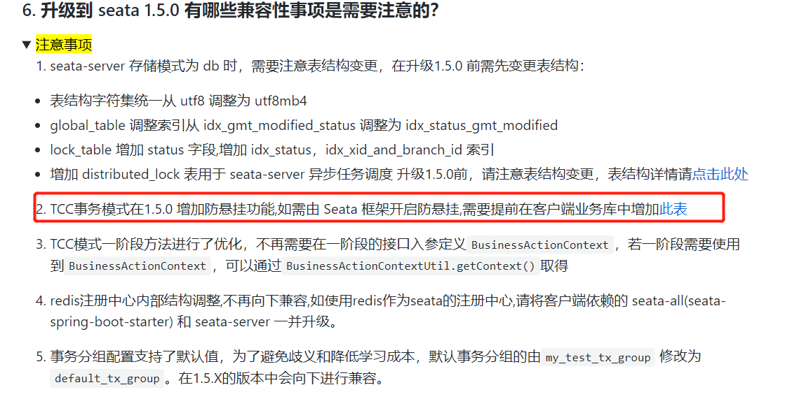
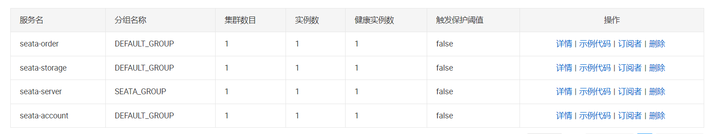

## 什么是TCC

一个分布式的全局事务，整体是 **两阶段提交** 的模型。全局事务是由若干分支事务组成的，分支事务要满足 **两阶段提交** 的模型要求，即需要每个分支事务都具备自己的：

- 一阶段 `prepare` 行为
- 二阶段 `commit` 或 `rollback` 行为

`TCC`在业务层面分开解释一下就分为

+ `try`：对资源进行检查和预留资源。

+ `confirm`：确认执行业务操作，处理预留资源。

+ `cancel`：回滚资源的预留操作。

`TCC`相比于`XA`和`AT`不再依赖于数据库对事物的支持，而是通过业务代码来解决。

- 一阶段 `prepare` 行为：调用 **自定义** 的 `prepare` 逻辑。
- 二阶段 `commit` 行为：调用 **自定义** 的 `commit` 逻辑。
- 二阶段 `rollback` 行为：调用 **自定义** 的 `rollback` 逻辑。

所谓 `TCC` 模式，是指支持把 **自定义** 的分支事务纳入到全局事务的管理中。

## TCC的问题及解决

### 二阶段幂等

因为网络问题，第二阶段方法(`confirm`或`cancel`)可能会被事务框架`seata`重复调用。如果二阶段方法不能保证幂等，可能会导致资源的重复使用或重复释放。

### 空回滚

由于网络问题，第一阶段方法`try`在二阶段方法`cancel`之后执行，可能会造成资源未被占用，就释放资源。

### 资源悬挂

由于网络问题，第一阶段方法`try`在二阶段方法`cancel`之后执行，`try`占用的资源无法得到释放。

### 解决



`seata`在1.5.0版本增加了一个表来解决上述问题(需要设置`useTCCFence=true`)

```sql
CREATE TABLE IF NOT EXISTS `tcc_fence_log`
(
    `xid`           VARCHAR(128)  NOT NULL COMMENT 'global id',
    `branch_id`     BIGINT        NOT NULL COMMENT 'branch id',
    `action_name`   VARCHAR(64)   NOT NULL COMMENT 'action name',
    `status`        TINYINT       NOT NULL COMMENT 'status(tried:1;committed:2;rollbacked:3;suspended:4)',
    `gmt_create`    DATETIME(3)   NOT NULL COMMENT 'create time',
    `gmt_modified`  DATETIME(3)   NOT NULL COMMENT 'update time',
    PRIMARY KEY (`xid`, `branch_id`),
    KEY `idx_gmt_modified` (`gmt_modified`),
    KEY `idx_status` (`status`)
) ENGINE = InnoDB
DEFAULT CHARSET = utf8mb4;
```

这个表用主事务id和分支事务id做联合主键

简单看一下`seata`是如何使用这个表来解决二阶段幂等、空回滚、资源悬挂问题的

+ 在第一阶段`try`：`seata`在调用预留资源逻辑前，会在`tcc_fence_log`表里创建一条数据，状态为`tried`。

+ 二阶段`commit`：会先根据主事务id和分支事务id查询`tcc_fence_log`，如果不存在，说明还没进行第一阶段的`try`；如果状态为`committed`说明事务已经提交过；如果状态为`rollbacked`说明事务已被回滚；如果状态为`suspended`说明事务被挂起，还不能继续执行。如果状态为`tried`说明事务可以正常被提交，那么执行提交逻辑，修改状态为`committed`。

+ 二阶段`cancel`：跟`commit`操作差不多，也会查询事务记录是否存在，并根据状态判断是否可以取消资源占用。若可以执行`cancel`操作，那么会修改状态为`cancel`。

可以看到`seata`通过这个表就可以解决上述问题。

## 示例

用一个用户下单，生成订单；扣减库存；扣减余额的操作来做一个`seata`的`TCC`示例。

### 1.创建表结构

准备三个库，分别对应三个服务。

- `demo_account`库中`account_tcc`表
  
  ```sql
  create table account_tcc
  (
      id           int auto_increment
          primary key,
      user_id      varchar(255)  null,
      money        int default 0 null,
      freeze_money int default 0 null
  );
  ```

- `demo_order`库中`order1`表
  
  ```sql
  create table order1
  (
      id             int auto_increment
          primary key,
      user_id        varchar(255)  null,
      commodity_code varchar(255)  null,
      count          int default 0 null,
      money          int default 0 null
  );
  ```

- `demo_storage`库中`storage_tcc`表
  
  ```sql
  create table storage_tcc
  (
      id             int auto_increment
          primary key,
      commodity_code varchar(255)  null,
      count          int default 0 null,
      freeze_count   int default 0 null,
      constraint commodity_code
          unique (commodity_code)
  );
  ```

然后分别在需要用到TCC的库中(`demo_account`,`demo_storage`)创建`tcc_fence_log`表(`Seata`使用)

```sql
CREATE TABLE IF NOT EXISTS `tcc_fence_log`
(
    `xid`           VARCHAR(128)  NOT NULL COMMENT 'global id',
    `branch_id`     BIGINT        NOT NULL COMMENT 'branch id',
    `action_name`   VARCHAR(64)   NOT NULL COMMENT 'action name',
    `status`        TINYINT       NOT NULL COMMENT 'status(tried:1;committed:2;rollbacked:3;suspended:4)',
    `gmt_create`    DATETIME(3)   NOT NULL COMMENT 'create time',
    `gmt_modified`  DATETIME(3)   NOT NULL COMMENT 'update time',
    PRIMARY KEY (`xid`, `branch_id`),
    KEY `idx_gmt_modified` (`gmt_modified`),
    KEY `idx_status` (`status`)
) ENGINE = InnoDB
DEFAULT CHARSET = utf8mb4;
```

### 2.项目编码

实现一个简单的下订单扣减余额和库存的功能。`order`服务为入口，创建订单，然后调用`account`扣减用户余额，调用`storage`服务扣库存，。

#### `order`服务

```java
@Service
public class OrderTCCServiceImpl extends ServiceImpl<OrderMapper, Order> implements OrderTCCService {

    @Resource
    private AccountTCCFeignClient accountTCCFeignClient;
    @Resource
    private StorageTCCFeignClient storageTCCFeignClient;
    @Resource
    private OrderMapper orderMapper;

    /**
     * 下单：创建订单、扣减余额，减库存，涉及到三个服务
     */
    @GlobalTransactional
    @Override
    @Transactional(rollbackFor = Exception.class)
    public void placeOrder(String userId, String commodityCode, Integer count) {
        Integer orderMoney = 5 * count;
        Order order = new Order();
        order.setCommodityCode(commodityCode);
        order.setCount(count);
        order.setMoney(orderMoney);
        order.setUserId(userId);
        orderMapper.insert(order);
        accountTCCFeignClient.deduct(userId, orderMoney);
        storageTCCFeignClient.deduct(commodityCode, count);
    }
}
```

使用`@GlobalTransactional`开启全局事务，否则`seata`不会接管。

方法首先往订单表插入一条数据，表示创建订单，然后调用`storage`服务和`account`服务进行扣减操作。

#### `account`服务：

##### AccountTCCService

```java
@LocalTCC
public interface AccountTCCService extends IService<AccountTCC> {

    @TwoPhaseBusinessAction(name = "deduct", commitMethod = "commitDeduct", rollbackMethod = "cancelDeduct", useTCCFence = true)
    void deduct(@BusinessActionContextParameter("userId") String userId,
                @BusinessActionContextParameter("price") Integer price);

    void commitDeduct(BusinessActionContext context);

    void cancelDeduct(BusinessActionContext context);
}
```

需要使用`@LocalTCC`注解来表示这是一个需要`Seata`处理的`TCC`接口。在`@TwoPhaseBusinessAction`中加上`useTCCFence = true`表示需要`seata`来解决幂等、资源悬挂、空回滚问题。

##### AccountTCCServiceImpl

```java
@Service
public class AccountTCCServiceImpl extends ServiceImpl<AccountTCCMapper, AccountTCC> implements AccountTCCService {
    
    @Override
    public void deduct(String userId, Integer price) {
        UpdateWrapper<AccountTCC> updateWrapper = new UpdateWrapper<>();
        updateWrapper.eq("user_id", userId)
                .ge("money", price);
        updateWrapper.setSql("money = money - " + price);
        updateWrapper.setSql("freeze_money = freeze_money + " + price);
        boolean update = this.update(updateWrapper);
        if (!update) {
            throw new RuntimeException("余额不足");
        }
    }

    @Override
    public void commitDeduct(BusinessActionContext context) {
        String userId = (String) context.getActionContext("userId");
        Integer price = (Integer) context.getActionContext("price");

        UpdateWrapper<AccountTCC> updateWrapper = new UpdateWrapper<>();
        updateWrapper.eq("user_id", userId)
                .ge("freeze_money", price);
        updateWrapper.setSql("freeze_money = freeze_money - " + price);
        boolean update = this.update(updateWrapper);
        if (!update) {
            throw new RuntimeException("冻结余额不足");
        }

    }

    @Override
    public void cancelDeduct(BusinessActionContext context) {
        String userId = (String) context.getActionContext("userId");
        Integer price = (Integer) context.getActionContext("price");

        UpdateWrapper<AccountTCC> updateWrapper = new UpdateWrapper<>();
        updateWrapper.eq("user_id", userId)
                .ge("freeze_money", price);
        updateWrapper.setSql("money = money + " + price);
        updateWrapper.setSql("freeze_money = freeze_money - " + price);
        boolean update = this.update(updateWrapper);
        if (!update) {
            throw new RuntimeException("冻结余额不足");
        }
    }
}
```

#### `storage`服务

##### StorageTCCService

```java
@LocalTCC
public interface StorageTCCService extends IService<StorageTCC> {

    @TwoPhaseBusinessAction(name = "deduct", commitMethod = "commitDeduct", rollbackMethod = "cancelDeduct", useTCCFence = true)
    void deduct(@BusinessActionContextParameter("commodityCode") String commodityCode,
                @BusinessActionContextParameter("count") int count);

    void commitDeduct(BusinessActionContext context);

    void cancelDeduct(BusinessActionContext context);

}
```

需要使用`@LocalTCC`注解来表示这是一个需要`Seata`处理的`TCC`接口。在`@TwoPhaseBusinessAction`中加上`useTCCFence = true`表示需要`seata`来解决幂等、资源悬挂、空回滚问题。

##### StorageTCCServiceImpl

```java
@Service
public class StorageTCCServiceImpl extends ServiceImpl<StorageTCCMapper, StorageTCC> implements StorageTCCService {

    /**
     * 预扣库存
     *
     * @param commodityCode 商品编码
     * @param count         数量
     */
    @Override
    @Transactional(rollbackFor = Exception.class)
    public void deduct(String commodityCode, int count) {
        if (commodityCode.equals("product-2")) {
            throw new RuntimeException("异常:模拟业务异常:stock branch exception");
        }

        UpdateWrapper<StorageTCC> updateWrapper = new UpdateWrapper<>();
        updateWrapper.eq("commodity_code", commodityCode)
                .ge("count", count)
                .setSql("count = count - " + count)
                .setSql("freeze_count = freeze_count + " + count);
        boolean update = this.update(updateWrapper);

        if (!update) {
            throw new RuntimeException("库存不足");
        }
    }

    /**
     * 提交扣库存
     */
    @Override
    public void commitDeduct(BusinessActionContext context) {
        String commodityCode = (String) context.getActionContext("commodityCode");
        Integer count = (Integer) context.getActionContext("count");

        UpdateWrapper<StorageTCC> updateWrapper = new UpdateWrapper<>();
        updateWrapper.eq("commodity_code", commodityCode)
                .ge("freeze_count", count)
                .setSql("freeze_count = freeze_count - " + count);
        boolean update = this.update(updateWrapper);

        if (!update) {
            throw new RuntimeException("冻结库存不足");
        }
    }

    /**
     * 取消扣库存
     */
    @Override
    public void cancelDeduct(BusinessActionContext context) {
        String commodityCode = (String) context.getActionContext("commodityCode");
        Integer count = (Integer) context.getActionContext("count");

        UpdateWrapper<StorageTCC> updateWrapper = new UpdateWrapper<>();
        updateWrapper.eq("commodity_code", commodityCode)
                .ge("freeze_count", count)
                .setSql("count = count + " + count)
                .setSql("freeze_count = freeze_count - " + count);
        boolean update = this.update(updateWrapper);

        if (!update) {
            throw new RuntimeException("冻结库存不足");
        }
    }
}
```

### 3.运行测试

`nacos`中的服务列表为



调用下单接口

- 若流程执行成功，则创建新订单，余额预扣减，库存预扣减，调用`account`和`storage`的`commitDeduct`扣减。
- 若余额不足，则回滚订单表，执行`account`的`cancelDeduct`操作释放预占金额
- 若库存不足，那么会回滚订单表，执行`storage`的`cancelDeduct`操作释放预占库存，执行`account`的`cancelDeduct`操作释放预占金额

> 注意：如果`commit`或`cancel`操作失败，那么`seata`会一直重试，直到执行成功。若出现这种情况且程序无法自己处理，就可能需要人工介入了。

## TCC优缺点

+ 无全局锁，性能高

+ 最终一致性。

+ 不依赖数据库对事务的支持，回滚提交都是在业务里解决。

+ 需要复杂的编码工作，业务入侵性大