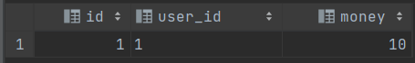
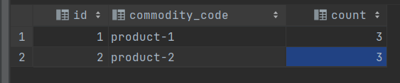
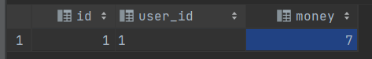
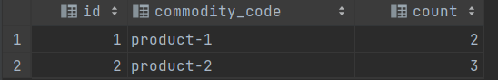

### XA事务

XA事务采用`2PC`来保证数据一致性，即需要`prepare`阶段和`commit`阶段。

准备两个库，来模拟XA事务

+ `demo_account`库里有`account`用户表
+ `demo_storage`库里有`storage`库存表

```sql
create table account
(
    id      int          null,
    user_id varchar(255) null,
    money   int          null
);

create table storage
(
    id             int          null,
    commodity_code varchar(255) null,
    count          int          null
);
```

`account`表中记录如下：



`storage`表中记录如下：



用数据库来模拟一下下单减库存，扣余额的操作。

#### 1.开始XA事务

##### account表：开始xa事务

```sql
xa begin  'tx_submit_order','account';
```

##### storage表：开始xa事务

```sql
xa begin  'tx_submit_order','storage';
```

#### 2.执行事务语句

##### account表：扣用户余额

```sql
update account set money = money - 3
where id = 1;
```

##### storage表：扣库存

```sql
update storage set count = count - 1
where commodity_code = 'product-1';
```

执行完毕后，事务并不会真正的提交，数据不会真正的修改，而是会被锁定。

如果这时有另外的事务更新会一直阻塞下去。

#### 3.结束事务

##### account表：

```sql
xa end 'tx_submit_order','account';
```

##### storage表：

```sql
xa end 'tx_submit_order','storage';
```

这里的结束事务，不是终止掉整个`XA`事务流程，而是应用不再修改数据，准备进入第二阶段。

#### 4.事务进入prepare阶段

业务逻辑执行正常，事务进入`prepare`阶段。

##### account表：

```sql
xa prepare  'tx_submit_order','account';
```

##### storage表：

```sql
xa prepare  'tx_submit_order','storage';
```

#### 5-1.提交事务

若事务协调者收到所有参与者的回应，那么就提交事务。在此案例中，事务协调者就是我们(因为是我们去做每个sql的执行操作)，参与者就是`account`表和`storage`表。

##### account表：

```sql
xa commit 'tx_submit_order','account';
```

##### storage表：

```sql
xa commit 'tx_submit_order','storage';
```

事务真正的被提交，此时数据才会被释放，发生改变。

`account`表中记录如下：



`storage`表中记录如下：



#### 5-2.回滚事务

如果参与者不能正确的执行事务语句，或者超时未收到参与者回复。那么回滚事务。

##### account表：

```sql
xa rollback  'tx_submit_order','account';
```

##### storage表：

```sql
xa rollback  'tx_submit_order','storage';
```

事务被回滚，变更不生效。

`account`表中记录如下：


`storage`表中记录如下：


### 总结

XA事务的优缺点都非常明确

+ 实现简单，对业务代码无侵入
+ 强一致性(正常情况下)
+ 需要数据库支持XA协议
+ 长时间锁定资源，同步阻塞
+ 采用2PC，可能出现数据不一致
